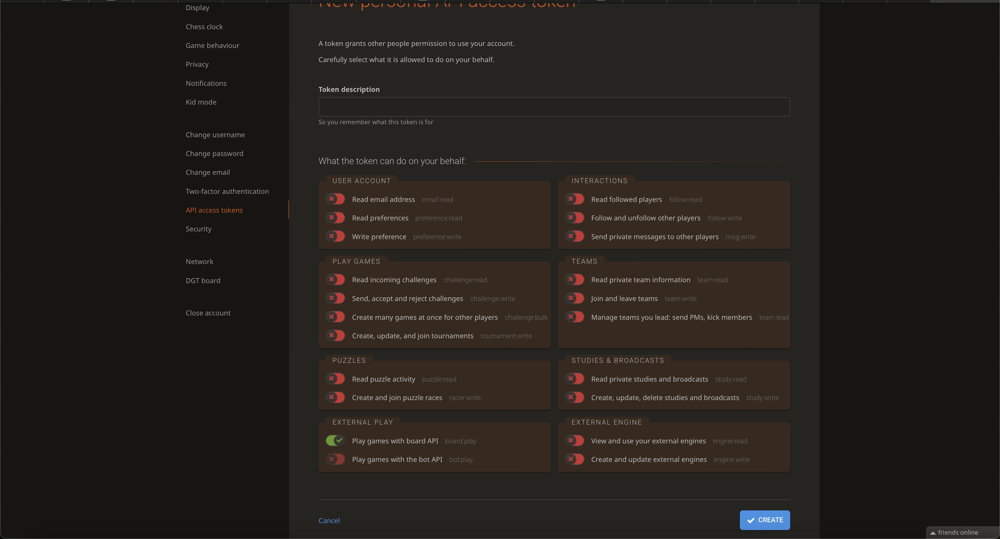

<h1 align="center">
    agent_uno :chess_pawn:
</h1>

An LLM agent built using Model Context Protocol to play online games

# Pre-requisites

- `uv` installable via brew.
- [Claude Desktop](https://claude.ai/download)
- Create [Lichess account](https://lichess.org/signup)
- Create [API key](https://lichess.org/account/oauth/token).
> [!NOTE]
> When creating an API key only the `board:play` scope is required.
>
> 

Set up project:

```bash
make project-setup
```

# Quick Start

1. Install server in Claude Desktop:

```bash
cd agent_uno
```

```bash
uv run mcp install server.py
```

2. Interact with MCP server with Claude Desktop.

Example prompt:

> Can you please log into the Chess API with the following API key ************ and then create a game. Once the game has been created the opponent will make the first move. Can you use the previous moves and the layout of the board to determine what an optimal next move will be and then make your own move playing continuously back and forth until completion? Please use the UCI chess standard for your moves, e.g., e2e4.

> [!NOTE]
> If you face issues with server starting in the Claude desktop this could be because of the relative path for the `command` in the server config. This will need to be changed to the absolute path to `uv` on your machine in this case. See [GH issue](https://github.com/cline/cline/issues/1160) for more details.
