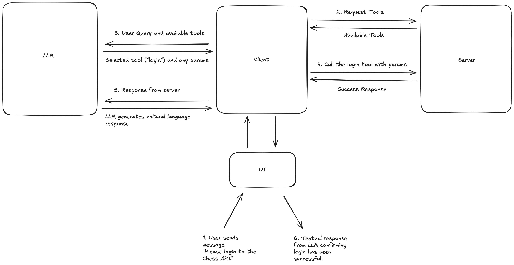

# Client Server Interaction

## How do clients and servers communicate?

1. Client sends an initialisation request to the server and receives the protocol version and capabilities from the server.


2. Client sends an initialisation notification to the server this acts as an acknowledgement of the server's response.


3. Normal message exchange begins. The client and server can send messages to each other using the request-response pattern or notifications.


The MCP documentation for [Client Developers](https://modelcontextprotocol.io/quickstart/client) describes how to connect to a server as a client. The following code snippet demonstrates how to implement this through the `stdio` transport method:

```python
async def connect_to_server(self, server_script_path: str):
    """Connect to an MCP server

    Args:
        server_script_path: Path to the server script (.py or .js)
    """
    is_python = server_script_path.endswith('.py')
    is_js = server_script_path.endswith('.js')
    if not (is_python or is_js):
        raise ValueError("Server script must be a .py or .js file")

    command = "python" if is_python else "node"
    server_params = StdioServerParameters(
        command=command,
        args=[server_script_path],
        env=None
    )

    stdio_transport = await self.exit_stack.enter_async_context(stdio_client(server_params))
    self.stdio, self.write = stdio_transport
    self.session = await self.exit_stack.enter_async_context(ClientSession(self.stdio, self.write))

    await self.session.initialize()

    # List available tools
    response = await self.session.list_tools()
    tools = response.tools
    print("\nConnected to server with tools:", [tool.name for tool in tools])
```

Breaking this down, we have:

1. Create server parameters for handling `stdio` transport:

```python
is_python = server_script_path.endswith('.py')
is_js = server_script_path.endswith('.js')
if not (is_python or is_js):
    raise ValueError("Server script must be a .py or .js file")

command = "python" if is_python else "node"
server_params = StdioServerParameters(
    command=command,
    args=[server_script_path],
    env=None
)
```

2. Create a `stdio` client session:

```python
stdio_transport = await self.exit_stack.enter_async_context(stdio_client(server_params))
self.stdio, self.write = stdio_transport
self.session = await self.exit_stack.enter_async_context(ClientSession(self.stdio, self.write))
```

3. Perform initialisation with the server:

```python
await self.session.initialize()
```

4. Begin message exchange with the server:

```python
# List available tools
response = await self.session.list_tools()
tools = response.tools
print("\nConnected to server with tools:", [tool.name for tool in tools])
```

## How does the client process user queries?

The MCP documentation for [Client Developers](https://modelcontextprotocol.io/quickstart/client) describes how to process user queries during the message exchange process using the LLM to make decisions on which tools should be chosen to fulfil the users request. The following code snippet demonstrates how to implement this:

```python
async def process_query(self, query: str) -> str:
    """Process a query using Claude and available tools"""
    messages = [
        {
            "role": "user",
            "content": query
        }
    ]

    response = await self.session.list_tools()
    available_tools = [{
        "name": tool.name,
        "description": tool.description,
        "input_schema": tool.inputSchema
    } for tool in response.tools]

    # Initial Claude API call
    response = self.anthropic.messages.create(
        model="claude-3-5-sonnet-20241022",
        max_tokens=1000,
        messages=messages,
        tools=available_tools
    )

    # Process response and handle tool calls
    final_text = []

    assistant_message_content = []
    for content in response.content:
        if content.type == 'text':
            final_text.append(content.text)
            assistant_message_content.append(content)
        elif content.type == 'tool_use':
            tool_name = content.name
            tool_args = content.input

            # Execute tool call
            result = await self.session.call_tool(tool_name, tool_args)
            final_text.append(f"[Calling tool {tool_name} with args {tool_args}]")

            assistant_message_content.append(content)
            messages.append({
                "role": "assistant",
                "content": assistant_message_content
            })
            messages.append({
                "role": "user",
                "content": [
                    {
                        "type": "tool_result",
                        "tool_use_id": content.id,
                        "content": result.content
                    }
                ]
            })

            # Get next response from Claude
            response = self.anthropic.messages.create(
                model="claude-3-5-sonnet-20241022",
                max_tokens=1000,
                messages=messages,
                tools=available_tools
            )

            final_text.append(response.content[0].text)

    return "\n".join(final_text)
```

Breaking this down, we have:

1. Format user message:
```python
messages = [
        {
            "role": "user",
            "content": query
        }
    ]
```
> The messages object is responsible for storing the message history allowing the LLM to have access to prior context.

2. List available tools:
```python
response = await self.session.list_tools()
```
> This is the same as the HTTP request to list tools in the [direct execution documentation](direct_execution.md).

3. Format available tools to be handed to Anthropic API:
```python
available_tools = [{
        "name": tool.name,
        "description": tool.description,
        "input_schema": tool.inputSchema
    } for tool in response.tools]
```

4. Make request to Anthropic API passing user message and available tools objects:

```python
response = self.anthropic.messages.create(
        model="claude-3-5-sonnet-20241022",
        max_tokens=1000,
        messages=messages,
        tools=available_tools
    )
```

5. Iterate through the response and process either the text or tool_use content type:
```
for content in response.content:
    if content.type == 'text':
        ...

    elif content.type == 'tool_use':
        ...
```
6. If the response content type is tool_use then the tool is executed:
```python
elif content.type == 'tool_use':
    tool_name = content.name
    tool_args = content.input

    # Execute tool call
    result = await self.session.call_tool(tool_name, tool_args)
    final_text.append(f"[Calling tool {tool_name} with args {tool_args}]")
```

7. Update messages object with next context:
```
# assistant response message
messages.append({
    "role": "assistant",
    "content": assistant_message_content
})
# user message with tool result
messages.append({
    "role": "user",
    "content": [
        {
            "type": "tool_result",
            "tool_use_id": content.id,
            "content": result.content
        }
    ]
})
```

8. Finally, re-prompt LLM with the updated messages object to get a final response to the user:

```python
response = self.anthropic.messages.create(
    model="claude-3-5-sonnet-20241022",
    max_tokens=1000,
    messages=messages,
    tools=available_tools
)

final_text.append(response.content[0].text)
```

The following diagram illustrates the end-to-end process of requesting the agent to login to the Lichess API from user query to response using the MCP server and LLM:



## Simplified Client Connection using FastMCP

The [FastMCP documentation](https://github.com/modelcontextprotocol/python-sdk?tab=readme-ov-file#writing-mcp-clients) outlines how the above two code snippets can be performed in a single block:

```python
from mcp import ClientSession, StdioServerParameters, types
from mcp.client.stdio import stdio_client

# Create server parameters for stdio connection
server_params = StdioServerParameters(
    command="python",  # Executable
    args=["example_server.py"],  # Optional command line arguments
    env=None,  # Optional environment variables
)


async def run():
    async with stdio_client(server_params) as (read, write):
        async with ClientSession(
            read, write
        ) as session:
            # Initialize the connection
            await session.initialize()

            # List available prompts
            prompts = await session.list_prompts()

            # Get a prompt
            prompt = await session.get_prompt(
                "example-prompt", arguments={"arg1": "value"}
            )

            # List available resources
            resources = await session.list_resources()

            # List available tools
            tools = await session.list_tools()

            # Read a resource
            content, mime_type = await session.read_resource("file://some/path")

            # Call a tool
            result = await session.call_tool("tool-name", arguments={"arg1": "value"})


if __name__ == "__main__":
    import asyncio

    asyncio.run(run())
```
